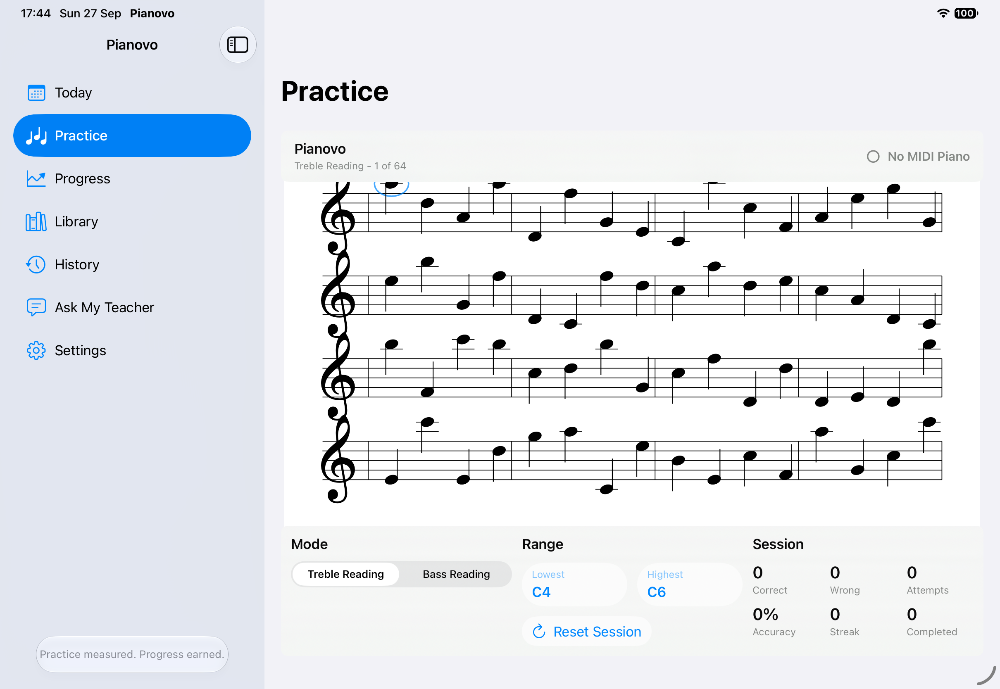
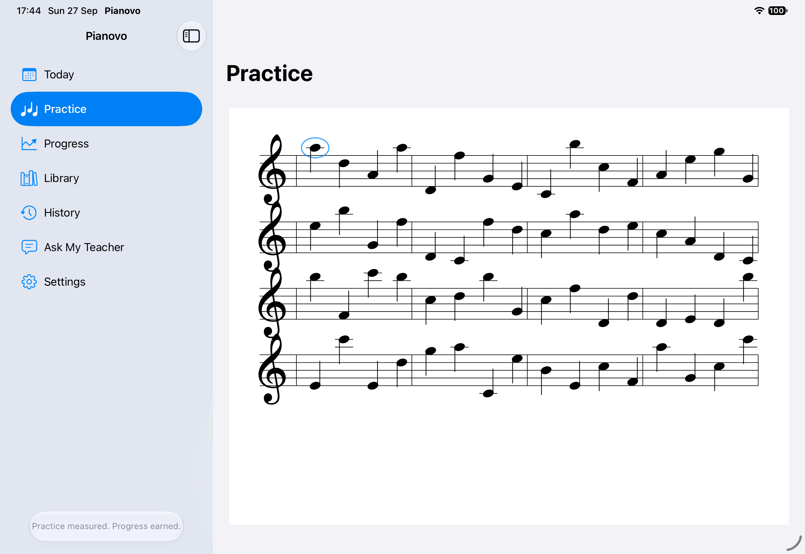

# Pianovo

*Practice measured. Progress earned.*

Pianovo is a native SwiftUI piano-practice app for iPhone and iPad. Its working experience turns a physical MIDI piano into an interactive sight-reading exercise: the app generates notation, listens for played notes through CoreMIDI, and advances only when the learner plays the expected pitch.

The project began with a personal learning problem. Static sheet music shows *what* to play, but it does not organise practice, measure the attempt, or help a learner and teacher agree on what comes next. Pianovo combines a working MIDI practice loop with foundations for a structured twelve-week programme, progress history, reference material, and future teacher-guided planning.

> **Development status:** active portfolio project. The Practice experience works today. The broader coaching, programme, document, and teacher workflows described below are foundations or roadmap items unless explicitly identified as user-facing.

## App preview

| Practice controls | Distraction-free score |
| --- | --- |
|  |  |

Both images are direct captures of the running app on an iPad Pro 11-inch (M5) simulator. The disconnected MIDI state is expected in the simulator.

## What works today

- Continuous single-staff **Treble Reading** and **Bass Reading** exercises.
- Responsive notation arranged into measures and systems on a paper-like practice surface.
- Quarter notes, stems, barlines, ledger lines, and a highlighted current event.
- Configurable natural-note ranges: C4-C6 for treble and C2-C4 for bass.
- Physical piano input through CoreMIDI, validated with a Yamaha P-45 and iPad.
- Correct notes advance the exercise; incorrect notes keep the current event active.
- A new 64-note exercise is generated after the current exercise is completed.
- Session-only counts for correct answers, wrong attempts, accuracy, streak, and completed prompts.
- Adaptive iPhone/iPad layout and an auto-hiding practice HUD that does not reflow the score.

The navigation shell also exposes Today, Progress, Library, History, Ask My Teacher, and Settings. At the current milestone, these destinations display honest “coming later” states rather than unfinished functionality.

## Implemented foundations

These components are implemented and tested, but they are **not yet complete user-facing workflows**:

- A framework-independent Music Domain and Full Score Domain with stable event identifiers.
- A limited MusicXML `score-partwise` importer.
- Development-only full-score rendering of MusicXML fixtures with Verovio.
- A validated twelve-week programme model beginning at Beyer Op. 101 No. 63.
- SwiftData repositories for programme progress, sessions, attempts, reflections, and mastery decisions.
- A logical reference-material catalogue that keeps licensing and file availability explicit.
- Today presentation state and production dependency composition; the Today screen itself remains a future milestone.

This distinction is deliberate: having a persistence model or view model in the codebase does not mean learners can already use the corresponding feature in the app.

## Engineering highlights

- **Native interaction:** SwiftUI and CoreMIDI provide a responsive practice loop with physical-instrument input.
- **Separated domains:** music, practice behaviour, curriculum, progress, rendering, and infrastructure have explicit boundaries.
- **Renderer strategy:** lightweight native notation supports interactive drills; Verovio is isolated behind a separate adapter for future full scores.
- **Stable identity:** score events, programme elements, assignments, and persisted records use deterministic identifiers.
- **Local-first persistence:** SwiftData is confined to an adapter layer behind asynchronous repository protocols.
- **Deterministic tests:** injected clocks, time zones, calendars, random sources, and in-memory stores avoid dependence on device state.
- **Responsible source handling:** reference PDFs and audio are not committed or bundled while usage rights remain unverified.

## Technology

- Swift, SwiftUI, and Swift Testing
- CoreMIDI
- SwiftData with a versioned schema and migration-plan scaffold
- Foundation `XMLParser` for the supported MusicXML subset
- Native SwiftUI/Core Graphics notation with the bundled Bravura SMuFL font
- Verovio through Swift Package Manager for development-facing full-score rendering
- WebKit, isolated to the Verovio SVG debug view

## My role

I created Pianovo to combine my experience in learning design with hands-on product and software development. I defined the learner problem, product direction, milestones, acceptance criteria, architecture boundaries, and test strategy; guided the iterative Swift implementation; reviewed each change; and validated MIDI behaviour on a Yamaha P-45.

The implementation has been developed with Codex as an AI coding collaborator. My contribution is therefore best described as product ownership and AI-assisted engineering: translating a real learning need into technical requirements, evaluating trade-offs, testing the result, diagnosing integration issues, and maintaining the product and repository documentation.

## Build and run

### Requirements

- A Mac with Xcode and an iOS/iPadOS 26.5 SDK or later.
- iOS/iPadOS deployment target 26.5.
- An iPhone or iPad simulator for the interface, or a compatible physical device for CoreMIDI input.
- Optional: a class-compliant MIDI piano and the appropriate USB connection. The hardware path has been validated with a Yamaha P-45 connected by USB-B to USB-C.

No API key is required for the current build. Verovio resolves automatically through Swift Package Manager at the revision pinned in `Package.resolved`.

### Xcode

1. Clone the repository: `git clone https://github.com/winlnist/pianovo.git`.
2. Open `Pianovo.xcodeproj`.
3. Select the shared `Pianovo` scheme.
4. Choose an iPhone/iPad simulator or a configured physical device.
5. Build and run.

For the most reliable physical MIDI startup sequence, connect the cable, power on the piano, and then launch Pianovo.

### Command line

Replace the destination when that simulator is not installed locally:

```bash
xcodebuild \
  -project Pianovo.xcodeproj \
  -scheme Pianovo \
  -destination 'platform=iOS Simulator,name=iPad Pro 11-inch (M5)' \
  build

xcodebuild \
  -project Pianovo.xcodeproj \
  -scheme Pianovo \
  -destination 'platform=iOS Simulator,name=iPad Pro 11-inch (M5)' \
  test
```

### Verified baseline

On 27 September 2026, the renamed project completed a clean build and all **175 tests across 19 suites passed** using an iPad Pro 11-inch (M5) simulator. The portfolio captures were produced from the running app on iPadOS 27.0.

The current Practice experience was also manually verified on 27 September 2026 using a physical iPad Pro with an M5 processor and a Yamaha P-45 digital piano connected directly by a USB-B to USB-C cable for USB MIDI. Pianovo received the played notes, correctly played notes advanced the sight-reading exercise, and session statistics updated, confirming that the core Practice workflow operated successfully on physical hardware.

## Current limitations

- Practice is single-staff and one note at a time; there is no mixed grand staff, two-hand, chord, or rhythm-aware practice yet.
- Generated exercises use natural pitches and quarter-note notation rather than full musical context.
- Session statistics are not yet connected to the SwiftData history foundation.
- Today, Progress, Library, History, Ask My Teacher, and Settings are not yet functional screens.
- MusicXML importing and Verovio rendering are development foundations without a production file picker or interactive-song UI.
- PDF/photo import, optical music recognition, audio recording, tempo analysis, teacher accounts, chat, and cloud sync are planned rather than implemented.
- MIDI reconnect/hot-plug behaviour needs more real-device hardening.
- The project retains known compiler-warning cleanup tasks despite the green build and test suite.

## Next milestones

1. Add the Today screen and an explicit start-programme flow using the existing Today state.
2. Connect practice sessions and assignment completion to the persistence/history foundation.
3. Introduce document access and licensed/user-imported reference-material presentation.
4. Add score-aligned MIDI timing and correctness analysis.
5. Build learner progress and teacher planning workflows before considering accounts or cloud sync.

See the detailed [roadmap](docs/ROADMAP.md) for completed milestones and longer-term work.

## Documentation

- [Product](docs/PRODUCT.md) — problem, audiences, present experience, and product direction.
- [Architecture](docs/ARCHITECTURE.md) — layers, dependencies, adapters, and persistence boundaries.
- [Roadmap](docs/ROADMAP.md) — completed milestones and planned work.
- [Music Domain](docs/MUSIC_DOMAIN.md) and [Score Domain](docs/SCORE_DOMAIN.md) — musical concepts and full-score model.
- [Practice Engine](docs/PRACTICE_ENGINE.md) — exercise generation, matching, and statistics.
- [Programme Domain](docs/PROGRAMME_DOMAIN.md) — twelve-week structure and mastery rules.
- [Persistence and History](docs/PERSISTENCE_AND_HISTORY.md) — stored records, schema, and deletion semantics.
- [Reference Materials](docs/REFERENCE_MATERIALS.md) — logical catalogue and document-access boundaries.
- [Import Pipeline](docs/IMPORT_PIPELINE.md) — MusicXML support and future PDF/photo recognition.
- [Contributor guidance](AGENTS.md) — constraints for future development work.
